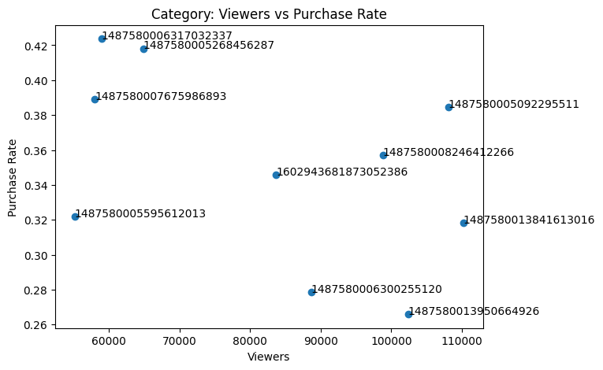
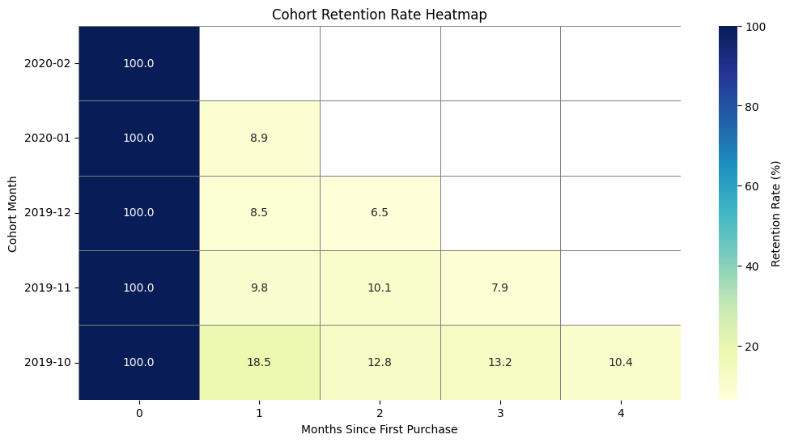

# 🛒 E-commerce Funnel & Cohort Retention Analysis  
> **End-to-end growth analytics case study identifying conversion bottlenecks, revenue impact, and seasonal retention decay for a mid-sized cosmetics e-commerce store.**

---

## 📌 Project Overview

This project analyzes **1.6M+ user behavior records** to:

- Identify critical funnel conversion bottlenecks  
- Quantify revenue impact of optimization scenarios  
- Analyze brand-level performance differences  
- Uncover seasonal cohort retention decay patterns  

Using **BigQuery (SQL)** for large-scale modeling and **Python** for matrix computation and visualization, this project translates behavioral data into actionable growth strategy insights.

---

# 💰 Executive Impact Summary

Using session-level revenue aggregation:

- **Total Revenue:** $6,348,004.87  
- **Total Orders:** 155,617  
- **Average Order Value (AOV):** $40.79  

### Estimated Revenue Opportunities

- **+5 percentage-point lift in Cart → Purchase conversion**  
  → **+$812K incremental revenue**

- **Optimizing checkout friction for high-engagement brand "runail"**  
  → **~$85K potential uplift**

- **Reducing extreme cart abandonment for "kapous"**  
  → **$30–50K revenue opportunity**

All projections are based on session-level AOV to reflect true order economics.

---

# 📊 Key Analysis & Insights

## 1️⃣ Overall Funnel Conversion (Macro View)

Tracked **1,639,358 unique visitors** across a four-stage funnel:

| Stage | Users |
|-------|--------|
| Total Visitors | 1,639,358 |
| Product Viewers | 1,597,754 |
| Cart Adders | 398,308 |
| Final Buyers | 110,518 |

### Core Bottlenecks

- **View → Cart:** 75.1% drop-off  
  → Indicates potential pricing, positioning, or product page friction  

- **Cart → Purchase:** 72.3% drop-off  
  → Suggests checkout friction, payment barriers, or shipping cost sensitivity  

---

## 2️⃣ Category & Brand-Level Breakdown

Conversion performance varies significantly by product category and brand.

| Category ID | Brand | Viewers | Cart Adders | Buyers | Add-to-Cart Rate | Purchase Rate |
|-------------|-------|---------|-------------|--------|------------------|---------------|
| 1602943681873052386 | grattol | 83,670 | 36,398 | 12,594 | 43.5% | 34.6% |
| 1487580013841613016 | kapous | 61,251 | 7,463 | 2,431 | 12.2% | 32.6% |
| 1487580005134238553 | runail | 27,225 | 20,807 | 6,465 | 76.4% | 31.1% |
| 1487580005092295511 | grattol | 22,136 | 13,324 | 3,933 | 60.2% | 29.5% |

### Brand-Level Insights

- **Friction Identification:**  
  Brand *kapous* exhibits extreme cart abandonment (~88%), indicating major conversion barriers.

- **High-Potential Segment:**  
  *runail* demonstrates strong engagement (76.4% add-to-cart rate) but suffers from 69% payment drop-off — making it a prime candidate for checkout optimization.

---

## 3️⃣ Cohort Retention Analysis

Users were segmented by first purchase month and tracked over a 5-month horizon.

### Retention Decay Insight

- October 2019 cohort: **18.5% Month-1 retention**
- December 2019 cohort: **8.5% Month-1 retention**

This represents a **54.1% decline**, suggesting holiday-driven acquisition generates lower long-term loyalty compared to standard-period customers.

---

# 📐 Key Metrics Definition

To ensure analytical rigor, the following core metrics were defined:

### Conversion Rate

Conversion Rate = Conversions ÷ Users at Previous Funnel Stage  

Examples:
- View → Cart = Cart Adders ÷ Product Viewers  
- Cart → Purchase = Buyers ÷ Cart Adders  

---

### Drop-off Rate

Drop-off Rate = 1 − Conversion Rate  

Or equivalently:

Drop-off Rate = (Users at Previous Stage − Users at Next Stage) ÷ Users at Previous Stage  

Example:
Cart Drop-off = (Cart Adders − Buyers) ÷ Cart Adders  

---

### Average Order Value (AOV)

Because a session may contain multiple purchase events (multiple items per order), revenue was aggregated at the **session level**.

AOV = Total Revenue ÷ Total Orders  

Where:
- Total Revenue = SUM(price) for purchase events  
- Total Orders = COUNT(DISTINCT user_session)  

In this dataset:
- Total Revenue = $6,348,004.87  
- Total Orders = 155,617  
- AOV = $40.79  

All revenue projections in this project are based on session-level AOV.

---

# 🚀 Strategic Recommendations

Based on data-driven findings:

### 🎯 Targeted Retargeting
Deploy abandoned cart email / paid remarketing for high-engagement brands (e.g., runail, grattol).

### 💳 Checkout Optimization
Reduce payment friction by:
- Guest checkout options  
- One-click payment  
- Transparent shipping costs  
- Streamlined mobile checkout  

### 📧 Lifecycle Management
Implement automated post-purchase onboarding and retention campaigns, especially for Q4-acquired cohorts.

---

# 🛠️ Tech Stack

**Data Warehouse:**  
- Google BigQuery (SQL) — Data cleaning, funnel modeling, cohort logic  

**Analysis & Computation:**  
- Python (Pandas, NumPy) — Matrix operations and retention modeling  

**Visualization:**  
- Matplotlib, Seaborn — Funnel visualization and cohort heatmaps  

**Environment:**  
- Google Colab  

---

# 📂 Project Structure

- `01_data_preprocessing.sql` — Data cleaning in BigQuery  
- `02_funnel_analysis.sql` — Funnel and dimensional modeling logic  
- `03_cohort_retention_logic.sql` — Cohort construction and retention calculation  
- `cosmetics_funnel_viz.ipynb` — Python visualization and analysis notebook  

---

## 📈 Business Value

This project demonstrates how behavioral event data can be transformed into:

- Funnel diagnostics  
- Revenue impact modeling  
- Segment-level performance optimization  
- Cohort-based retention strategy  

Bridging technical analytics with measurable business growth.
