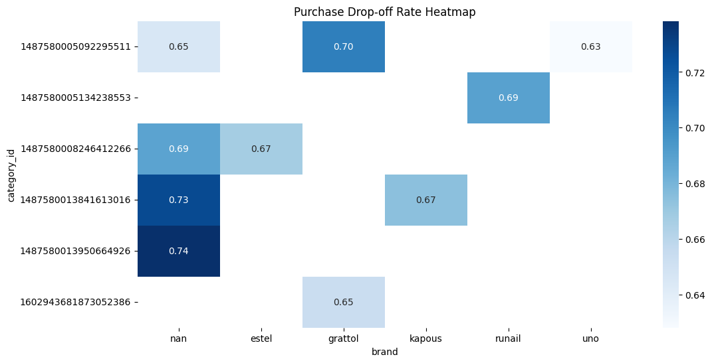

# 🛒 E-commerce Funnel & Cohort Retention Analysis
> **End-to-end data analytics project identifying conversion bottlenecks and seasonal retention trends for a mid-sized cosmetics online store.**

---

## 📌 Project Overview
This project analyzes user behavior data (1.6M+ records) to optimize the marketing funnel and customer lifetime value (LTV). By leveraging **BigQuery** for large-scale data modeling and **Python** for matrix computations, I identified critical drop-off points and seasonal retention shifts that inform growth strategies.

## 🛠️ Tech Stack
* **Data Warehouse:** Google BigQuery (SQL) — Large-scale data cleaning, funnel modeling, and cohort definition.
* **Analysis:** Python (Pandas, NumPy) — Matrix operations and retention logic.
* **Visualization:** Matplotlib, Seaborn — Funnel plots and retention heatmaps.
* **Environment:** Google Colab.

---

## 📊 Key Analysis & Insights

### 1. Overall Funnel Conversion (Macro View)
By tracking **1,639,358** unique visitors, I constructed a four-stage funnel to visualize the journey from landing to purchase.

> #### 📈 Funnel Metrics
> * **Total Visitors:** `1,639,358` 
> * **Product Viewers:** `1,597,754` 
> * **Cart Adders:** `398,308` 
> * **Final Buyers:** `110,518`

**Core Bottlenecks:**
* **View → Cart:** Significant **75.1% drop-off**, indicating potential issues with product detail pages or pricing.
* **Cart → Purchase:** **72.3% drop-off**, suggesting friction in the checkout process or high shipping costs.

---

### 2. Category & Brand Breakdown (Dimensional Analysis)
A granular breakdown reveals that conversion performance varies significantly across different product segments.

| Category ID | Brand | Viewers | Add-to-Cart Rate | Purchase Rate |
| :--- | :--- | :--- | :--- | :--- |
| 1602943681873052386 | grattol | 83,670 | 43.5% | 34.6% |
| 1487580013950664926 | None | 69,436 | 16.2% | 26.2% |
| 1487580013841613016 | kapous | 61,251 | 12.2% | 32.6% |
| 1487580005092295511 | None | 52,449 | 31,086 | 11,020 | 59.3% | 35.5% |
| 1487580008246412266 | None | 30,697 | 10,625 | 3,307 | 34.6% | 31.1% |
| 1487580005092295511 | uno | 30,421 | 15,417 | 5,732 | 50.7% | 37.2% |
| 1487580008246412266 | estel | 30,231 | 10,445 | 3,478 | 34.6% | 33.3% |
| 1487580005134238553 | runail | 27,225 | 20,807 | 6,465 | 76.4% | 31.1% |
| 1487580013841613016 | None | 26,483 | 6,844 | 1,867 | 25.8% | 27.3% |
| 1487580005092295511 | grattol | 22,136 | 13,324 | 3,933 | 60.2% | 29.5% |

#### **Drop-off Heatmap Insights**
| Add-to-Cart Drop-off | Purchase Drop-off |
| :---: | :---: |
|  |  |

* **Friction Identification:** Specific brands like **"kapous" (ID ...13016)** exhibit extreme cart abandonment rates of **88%**.
* **High Potential:** Items from **"runail"** maintain high engagement (76.4% add-to-cart) but suffer from a **69% payment drop-off**, representing a prime candidate for checkout optimization.

---

### 3. Cohort Retention (User Behavior Analysis)
Users were segmented by their first purchase month to track loyalty over a 5-month period.

**Insights on Retention Decay:**
* **Significant Decline:** New users from Oct 2019 had an **18.5% Month-1 retention**, whereas Dec 2019 users dropped to **8.5%**.
* **Magnitude:** This represents a **54.1% decrease** in early retention, suggesting that holiday shoppers (Q4 promotions) have lower long-term loyalty compared to standard-period customers.

---

## 🚀 Strategic Recommendations
Based on the data-driven insights, I propose the following business optimizations:

* **🎯 Targeted Retargeting:** Deploy abandoned cart email/ads for categories with >50% churn but high add-to-cart rates (e.g., `grattol`, `runail`).
* **💳 Checkout Experience:** Minimize payment friction (72.3% drop-off) by offering guest checkouts, one-click payments, or transparent shipping costs.
* **📧 Lifecycle Management:** Implement an automated **"Welcome Email Series"** specifically for peak-season cohorts to stabilize the rapid Month-1 retention decline.

---

## 📂 Project Structure
* `01_data_preprocessing.sql`: SQL scripts for raw data cleaning in BigQuery.
* `02_funnel_analysis.sql`: Logic for multi-stage funnel and dimensional breakdown.
* `03_cohort_retention_logic.sql`: SQL for cohort definition and retention rate computation.
* `cosmetics_funnel_viz.ipynb`: Python notebook for Seaborn visualizations and matrix analysis.

